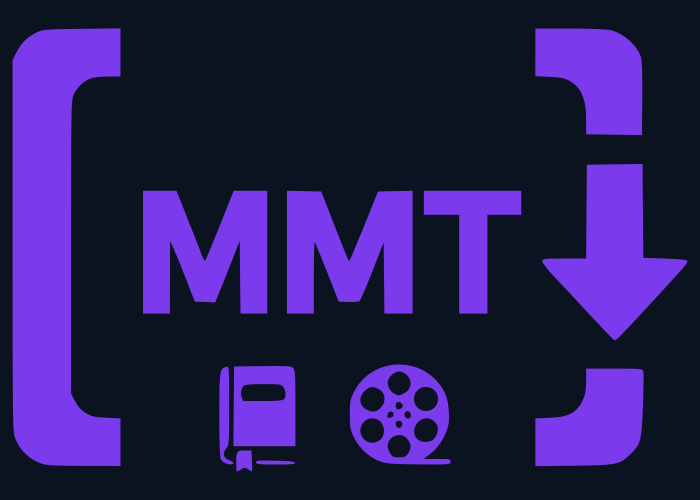
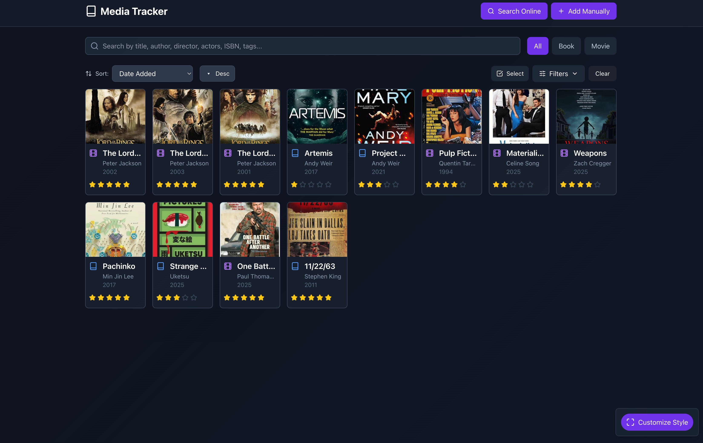
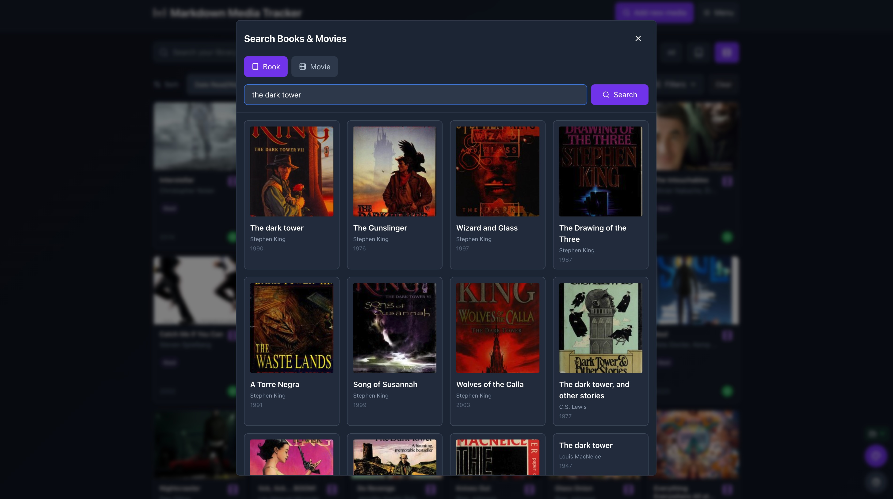
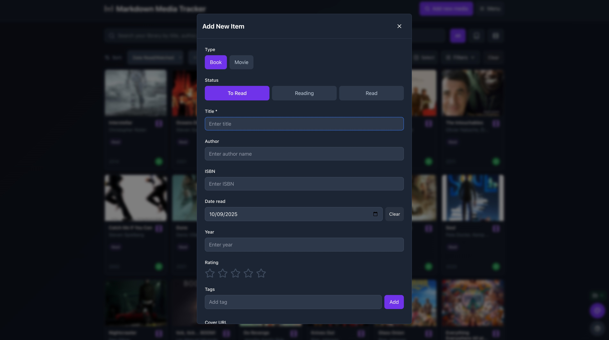
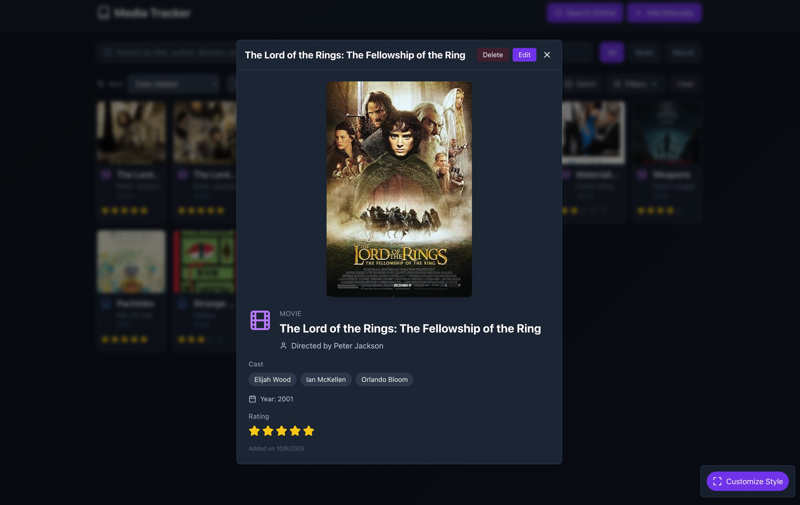
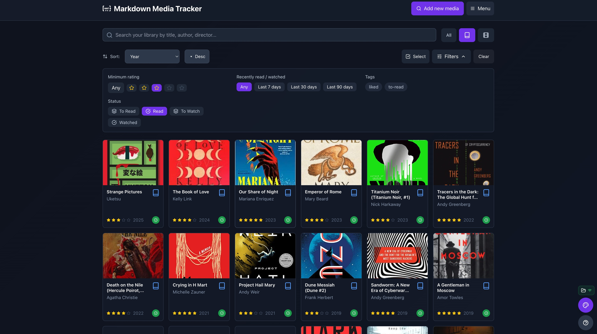
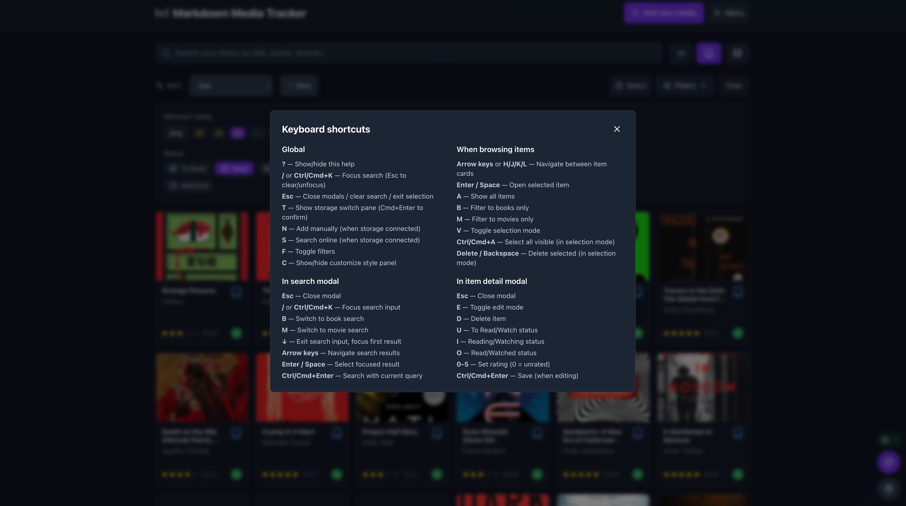
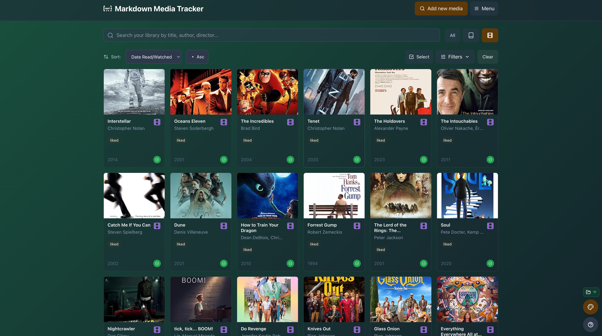
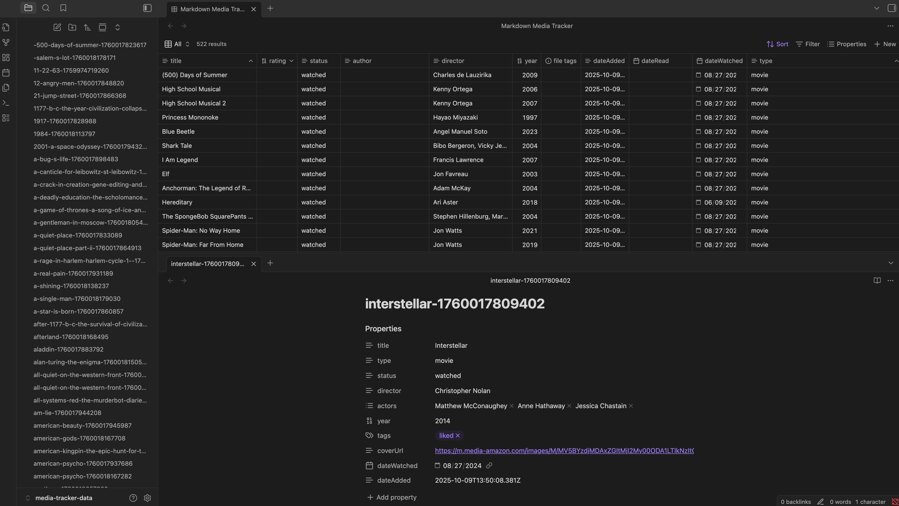

# Markdown Media Tracker

[](https://github.com/samsledje/markdown-media-tracker/actions)
[](https://codecov.io/gh/samsledje/markdown-media-tracker)
[](https://opensource.org/licenses/MIT)
[](https://samsledje.github.io/markdown-media-tracker/)


A small, local-first app for tracking books and movies saved as Markdown files with YAML frontmatter. Built with React + Vite with flexible storage options — use local directories or sync with Google Drive.

## Why Markdown Media Tracker?

**Privacy-First Storage**  
Your data stays yours. Choose local storage or Google Drive—no third-party servers, no tracking, no subscriptions.

**Markdown-Powered**  
Each item is a simple `.md` file with YAML frontmatter. Works seamlessly with Obsidian, Git, and your favorite text editor.

**Rich Features**  
Search Open Library and OMDb, import from Goodreads/Letterboxd, filter by rating, tags, and status (including DNF), and customize your view.

**Keyboard-First**  
Navigate your entire library without touching the mouse. Comprehensive shortcuts for power users who want speed.

### Key Features

- Store each item (book or movie) as a single `.md` file with YAML frontmatter.
- Browse, search, filter, sort, and batch-edit items.
- Add items manually or search online (Open Library for books, OMDb for movies).
- Choose between local storage or Google Drive synchronization.
- Customize card size and theme colors.

## Requirements

- Node.js (14+ recommended) and npm or yarn
- For **local storage**: A Chromium-based desktop browser (Chrome, Edge) that supports the File System Access API
- For **Google Drive**: Any modern browser (Chrome, Firefox, Safari, Edge)

Example data is included in the `data/` folder so you can browse sample items without connecting to storage.

## Install & run locally

1. Install dependencies

```bash
npm install
# or
# yarn
```

2. Start the dev server (Vite)

```bash
npm run dev
# or
# yarn dev
```

3. Open the URL printed by Vite (usually `http://localhost:5173`) in a supported browser.


## Storage Options

When you first open the app, you'll be prompted to choose your storage method:

### Local Directory Storage

Choose this option to store files directly on your device:

- **Best for**: Desktop users who want full control over their files
- **Requirements**: Chrome, Edge, or Opera on desktop (File System Access API)
- **How it works**: Select or create a directory where the app will save individual `.md` files
- **Benefits**: 
  - Files stay on your device
  - Works offline
  - Full control over file location
  - Compatible with Obsidian and other markdown tools

**Connection Persistence**: The app remembers your selected directory and automatically reconnects when you refresh the page or reopen the tab. However, browsers may revoke File System Access permissions when the browser is completely closed, depending on your browser's security settings. If this happens, you'll simply need to select your directory again—all your files remain safely in place.

### Google Drive Storage

Choose this option to sync your library across devices:

- **Best for**: Users who want to access their library from multiple devices
- **Requirements**: Google account and any modern browser
- **How it works**: 
  1. Click "Select Google Drive" 
  2. **Configure folder name** (optional): Change from "MarkdownMediaTracker" to any custom name
  3. Click "Connect to Google Drive"
  4. Sign in and grant permissions when prompted
  5. Your files will be stored in the configured folder in your Google Drive
- **Benefits**:
  - Access from any device (desktop, mobile, tablet)
  - Automatic cloud backup
  - Share access across devices
  - Files remain accessible through Google Drive web interface

**Connection Persistence**: Your Google Drive connection persists across browser sessions. The app automatically reconnects when you return, even after closing the browser completely.

#### Performance Optimizations

Google Drive storage includes several performance optimizations for handling large libraries:

- **Smart Caching**: Items are cached locally using IndexedDB after first load. Subsequent loads only download new or modified files, dramatically reducing load times for large libraries (100+ items).
- **Batch Processing**: Downloads 100 files concurrently using HTTP/2 multiplexing, taking full advantage of modern browser capabilities.
- **Pagination Support**: Automatically handles folders with more than 1,000 items using Google Drive API pagination.
- **Progress Reporting**: Real-time progress updates during initial loads show exactly how many items have been processed.
- **Cache Invalidation**: Cache automatically updates when items are modified, deleted, or added, ensuring data consistency.
- **Manual Cache Control**: Clear the cache manually via the Storage Indicator dropdown if needed to force a fresh download.

### Switching Storage

You can switch between storage options at any time:

1. Click the menu button (☰) in the top right
2. Select "Switch Storage" (at the bottom)
3. Choose a different storage option
4. **Note**: Existing files will remain in their current location — you'll need to manually move them if desired

## Keyboard Shortcuts

The app includes comprehensive keyboard shortcuts for efficient navigation and control. Press **?** at any time to view the help modal with all shortcuts.

### Global Shortcuts

| Key | Action |
|-----|--------|
| **?** | Show/hide keyboard shortcuts help |
| **/** or **Ctrl/Cmd+K** | Focus search (Esc to clear/unfocus) |
| **Esc** | Close modals / clear search / exit selection mode |
| **T** | Switch storage (show storage selector) |
| **N** | Add item manually (when storage connected) |
| **S** | Search online for books/movies (when storage connected) |
| **F** | Toggle filters panel |
| **C** | Show/hide customize appearance panel |

### Browsing & Navigation

| Key | Action |
|-----|--------|
| **Arrow keys** or **H/J/K/L** | Navigate between cards (vim-style: H=left, J=down, K=up, L=right) |
| **Enter** or **Space** | Open selected item detail (or toggle selection in selection mode) |
| **A** | Show all items |
| **B** | Filter to books only |
| **M** | Filter to movies only |

### Selection Mode

| Key | Action |
|-----|--------|
| **V** | Toggle selection mode on/off |
| **Ctrl/Cmd+A** | Select all visible items (in selection mode) |
| **Space** or **Enter** | Toggle selection of focused item (in selection mode) |
| **Delete** or **Backspace** | Delete selected items (in selection mode) |
| **Esc** | Exit selection mode (or close delete confirmation if open) |

### Search Modal

| Key | Action |
|-----|--------|
| **/** or **Ctrl/Cmd+K** | Focus search input |
| **B** | Switch to book search |
| **M** | Switch to movie search |
| **Ctrl/Cmd+Enter** | Execute search |
| **Esc** | Close search modal |

### Item Detail Modal

| Key | Action |
|-----|--------|
| **E** | Toggle edit mode |
| **D** | Delete item |
| **U** | Set status to "To Read/Watch" |
| **I** | Set status to "Reading/Watching" (In Progress) |
| **O** | Set status to "Read/Watched" (Completed) |
| **X** | Set status to "Did Not Finish" (DNF) |
| **0-5** | Set rating (0 = unrated, 1-5 = star rating) |
| **Ctrl/Cmd+Enter** | Save changes (when editing) |
| **Esc** | Close modal |

### Smart Navigation Features

- **Responsive Grid Navigation**: Up/down arrows automatically detect the actual number of columns based on card size and screen width
- **Smooth Scrolling**: Navigation automatically scrolls focused cards into view
- **Visual Focus Indicators**: Clearly shows which card is currently focused
- **Modal-Aware**: Shortcuts intelligently disable/enable based on current modal state
- **Selection Integration**: Navigation works seamlessly with selection mode for bulk operations

## Configure the OMDb API key

The app uses OMDb (for movie lookups) and Open Library (for books). For movie searches, you'll need a free OMDb API key:

1. **Get a free API key**: Visit [omdbapi.com](http://www.omdbapi.com/apikey.aspx) and enter your email to get a free API key.
2. **Configure in the app**: When you first use the app, you'll see an API key management panel. Enter your key there and click Save.
3. **Storage**: Your API key is stored securely in your browser's localStorage and never sent to any third-party servers except OMDb.

The app will work without an API key, but movie search functionality will be disabled until you configure one.

If you don't provide an OMDb API key the movie search functionality will be limited or fail — the app will still work for manual entry and browsing local markdown files.

## Screenshots

### Main Library View



Keep track of books and movies in one central library with a clean, customizable interface.

### Online Search



Search Open Library and OMDb to quickly add new items with automatic metadata retrieval.

### Manual Entry & Editing



Manually add or edit items with full control over all details and metadata.

### Item Details



View comprehensive information for each book or movie, including cover art, ratings, tags, and your notes.

### Sort & Filter



Sort and filter your collection by rating, tags, status, type, and more to find exactly what you're looking for.

### Keyboard Navigation



Navigate efficiently with comprehensive keyboard shortcuts for power users who want speed and efficiency.

### Custom Colors & Themes



Customize card sizes, colors, and themes to match your personal style and preferences.

### Markdown Files & Obsidian



Your entire library consists of simple markdown files with YAML frontmatter, fully compatible with Obsidian and other markdown editors.

## Obsidian Compatibility

Markdown Media Tracker is **fully compatible with Obsidian** and particularly well-suited for use with the new [**Bases**](https://help.obsidian.md/bases) feature

### What is Obsidian Bases?

Obsidian Bases is a powerful feature that allows you to create interactive filtered lists of notes. It turns any set of notes into a database-like view with filtering, sorting, and multiple view options (Table and Card views).

### How MMT Works with Obsidian

**YAML Frontmatter Structure**: Each media item is saved as a standalone `.md` file with structured YAML frontmatter containing metadata like title, type, author/director, year, rating, tags, and dates. This format is natively recognized by Obsidian's Properties system.

**Base-Ready Organization**: Your media library directory can be opened as an Obsidian vault or nested within an existing vault. Once opened, you can:
- Create a Base that filters for `type: book` or `type: movie`
- Use Obsidian's native filters to show items by rating, tags, or date ranges
- Switch between Table and Card views to see your collection
- Sort by any property (title, year, rating, date added, etc.)
- Leverage Obsidian's search and tagging system

**Example Base Setup**:
1. Open your media directory as an Obsidian vault
2. Enable the Bases plugin (Settings → Core Plugins → Bases)
3. Create a new Base
4. Add filters: `type = book` or `type = movie`
5. Display properties: title, author/director, year, rating, tags
6. Switch between views to see your collection as a table or cards

**Best of Both Worlds**: Use this React app for quick data entry, online search, and batch operations. Use Obsidian for deep linking between media notes and other notes in your vault, creating reading lists, or analyzing your library with Dataview queries.

**Notes in Obsidian**: The body content of each `.md` file (after the frontmatter) contains your review or notes, which can include standard Obsidian markdown features like internal links, embeds, and formatting.

### Create Obsidian Base Automatically

The app now includes a convenience action to create an Obsidian Base configuration file for your library. Open the app, connect to your storage (Local Directory or Google Drive), then open the "Menu" (☰). Click "Create Obsidian Base". The app will:

- Check whether a file named `Markdown Media Tracker.base` already exists in the selected storage folder.
- If it doesn't exist, the app will create `Markdown Media Tracker.base` (YAML content) in the root of your storage folder.
- If the file already exists, the app will leave it unchanged and notify you.

After creating the file, you can open the same folder as a vault in Obsidian and use the Bases feature to view your library as a table or cards. The generated `.base` file defines a default set of views for All items, Books, and Movies and is safe to edit or replace later from within Obsidian.

## Batch Operations

The app supports efficient batch operations for managing multiple items at once:

### Selection Mode

Press **V** or click the selection icon to enter selection mode, where you can:

- **Select Multiple Items**: Click items to toggle selection, or use **Ctrl/Cmd+A** to select all visible items
- **Navigate While Selecting**: Use arrow keys or vim keys (H/J/K/L) to move between items, then press **Space** to toggle selection
- **Visual Feedback**: Selected items are highlighted with a checkmark overlay

### Batch Edit

With items selected, click "Batch Edit" to apply changes to multiple items simultaneously:

- **Supported Changes**: Type, author/director, year, rating, status, dates, and tags
- **Add Tags**: Add new tags to all selected items (preserves existing tags)
- **Remove Tags**: Remove specific tags from all selected items
- **Progress Tracking**: Real-time progress indicator shows how many items have been updated
- **Efficient Processing**: Changes are applied with throttled progress updates to minimize UI overhead
- **Single Reload**: All changes are saved first, then the library reloads only once at the end

### Batch Delete

Delete multiple items at once:

- **Confirmation Dialog**: Shows exactly how many items will be deleted before proceeding
- **Progress Tracking**: Visual indicator during deletion process
- **Efficient Processing**: Items are deleted sequentially with throttled progress updates
- **Single Reload**: Library reloads only once after all deletions complete
- **Safety Features**: Deleted items are moved to a `.trash` folder in Google Drive (can be manually restored from there)

### Performance Notes

Batch operations are optimized for large selections:

- **Throttled Progress Updates**: Progress indicators update every 5-10 items instead of after each one, reducing UI re-renders
- **Deferred Reloads**: The app only reloads the item list once after all operations complete
- **Background Processing**: Operations continue even if you switch tabs (on supported browsers)
- **Error Handling**: Individual item failures don't stop the entire batch operation

## Import & Export CSV

- Export CSV: When you've selected a directory, click the "Export CSV" button in the header to download a CSV snapshot of your current library. Fields include title, type, author/director, year, rating, read/watched dates, tags, cover URL, and notes.
- Import CSV: Click "Import CSV" and choose a CSV file exported from this app or a supported service. The app attempts to detect common formats (Goodreads for books, Letterboxd for movies) and will map columns to the internal item fields. Imported items are saved as individual `.md` files in the selected directory with optimized batch processing.
- Goodreads: Export your "Bookshelf" CSV from Goodreads (My Books → Import/Export). The importer will look for columns like "Title", "Author", "My Rating", "My Review", and "Date Read" and map them to items.
- Letterboxd: Export your CSV from Letterboxd (Settings → Data → Export). The importer will look for columns like "Name", "Year", "Your Rating", and "Date Watched" and map them to movie items.

The importer uses simple heuristics and may not perfectly map every custom CSV. Review imported items and edit any missing details. Basic deduplication is performed by matching Title + Author; duplicates will be skipped. Import operations use batch-optimized saving that prevents reloading after each individual item, significantly improving performance for large imports.

### Import from Goodreads

Export your "Bookshelf" CSV from Goodreads (My Books → Import/Export) and import it directly. The app will automatically:

- Detect the Goodreads format and map columns like "Title", "Author", "My Rating", "My Review", and "Date Read"
- Enrich missing metadata using Open Library lookups by ISBN
- Save each book as an individual `.md` file in your library

### Import from Letterboxd

Letterboxd users can import their complete movie history using the full export:

1. **Export your data**: Go to Letterboxd Settings → Data → Export Your Data and download the ZIP file
2. **Import the ZIP**: Click "Import CSV" in the app and select the downloaded ZIP file
3. **Automatic processing**: The app will process multiple files in the correct order:
   - **watched.csv** and **watchlist.csv**: Creates movie entries with watch status
   - **ratings.csv**: Updates existing movies with your ratings
   - **reviews.csv**: Adds your reviews and merges tags
   - **films.csv** (liked films): Adds a "liked" tag to existing movies

The importer intelligently matches movies across files by title, director, and year to avoid duplicates and properly merge all your data. Movie metadata is automatically enriched using OMDb lookups.

**Single CSV Import**: You can also import individual Letterboxd CSV files (like a standalone ratings export) if you prefer.

### Import Notes

- **Smart deduplication**: The app detects duplicates by matching title + author (books) or title + director (movies) to prevent duplicate entries
- **Automatic enrichment**: Book imports use ISBN lookups via Open Library, movie imports use OMDb to fill missing metadata
- **Progress tracking**: Real-time progress updates show you how many items have been processed during import
- **Error handling**: If individual items fail to import, the process continues with remaining items

## Troubleshooting

### Storage Issues

- **File System Access API not available**: If your browser doesn't support the File System Access API (Safari on macOS and iOS currently lacks full support), local directory storage will not work. Options:
  - **Use Google Drive storage instead** (works in all modern browsers)
  - Use Chrome or Edge on desktop for local storage
  - Run the app inside an Electron wrapper that enables the API

- **Google Drive connection issues**: If Google Drive authentication fails:
  - Ensure popups are allowed for the app's domain
  - **On mobile**: Allow popups in browser settings (iOS Safari: Settings → Safari → Pop-ups)
  - Try using an incognito/private browsing window
  - Check that your Google account has Drive access enabled
  - Verify your internet connection

- **Google Drive slow loads**: If initial loads are slow for large libraries (100+ items):
  - **First load**: Initial loads download all files and can take time for large libraries. Progress is shown in real-time.
  - **Subsequent loads**: Should be much faster due to caching. Only new/modified files are downloaded.
  - **Clear cache**: If you suspect cache issues, use the Storage Indicator dropdown menu to "Clear Cache" and force a fresh download.
  - **Network**: Ensure stable internet connection. The app downloads files in batches of 100 concurrently for optimal performance.

### API Issues

- **OMDb rate limits / API key**: If movie searches fail, confirm your OMDb key is configured in the app's API settings. OMDb requires a (free) API key you can get at <http://www.omdbapi.com/apikey.aspx>.

## Contributing

Contributions are welcome! Please see [CONTRIBUTING.md](CONTRIBUTING.md) for detailed information about the project structure, development guidelines, and how to contribute.

## License

This project is licensed under the terms in the repository `LICENSE` file.

---
