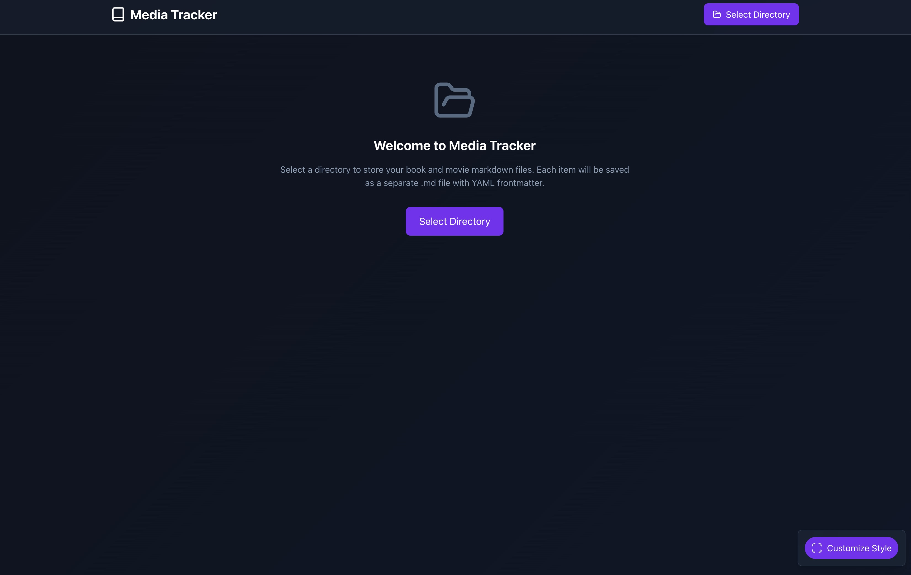

# Markdown Media Tracker

A small, local-first app for tracking books and movies saved as Markdown files with YAML frontmatter. Built with React + Vite with flexible storage options — use local directories or sync with Google Drive.

- Store each item (book or movie) as a single `.md` file with YAML frontmatter.
- Browse, search, filter, sort, and batch-edit items.
- Add items manually or search online (Open Library for books, OMDb for movies).
- Choose between local storage or Google Drive synchronization.
- Customize card size and theme colors.

## Requirements

- Node.js (14+ recommended) and npm or yarn
- For **local storage**: A Chromium-based desktop browser (Chrome, Edge) that supports the File System Access API
- For **Google Drive**: Any modern browser (Chrome, Firefox, Safari, Edge)

Example data is included in the `data/` folder so you can browse sample items without connecting to storage.

## Install & run locally

1. Install dependencies

```bash
npm install
# or
# yarn
```

2. Start the dev server (Vite)

```bash
npm run dev
# or
# yarn dev
```

3. Open the URL printed by Vite (usually `http://localhost:5173`) in a supported browser.

## Storage Options

When you first open the app, you'll be prompted to choose your storage method:

### Local Directory Storage

Choose this option to store files directly on your device:

- **Best for**: Desktop users who want full control over their files
- **Requirements**: Chrome, Edge, or Opera on desktop (File System Access API)
- **How it works**: Select or create a directory where the app will save individual `.md` files
- **Benefits**: 
  - Files stay on your device
  - Works offline
  - Full control over file location
  - Compatible with Obsidian and other markdown tools

### Google Drive Storage

Choose this option to sync your library across devices:

- **Best for**: Users who want to access their library from multiple devices
- **Requirements**: Google account and any modern browser
- **How it works**: 
  1. Click "Select Google Drive" 
  2. **Configure folder name** (optional): Change from "MarkdownMediaTracker" to any custom name
  3. Click "Connect to Google Drive"
  4. Sign in and grant permissions when prompted
  5. Your files will be stored in the configured folder in your Google Drive
- **Benefits**:
  - Access from any device (desktop, mobile, tablet)
  - Automatic cloud backup
  - Share access across devices
  - Files remain accessible through Google Drive web interface

### Switching Storage

You can switch between storage options at any time:

1. Click the menu button (☰) in the top right
2. Select "Switch Storage" (at the bottom)
3. Choose a different storage option
4. **Note**: Existing files will remain in their current location — you'll need to manually move them if desired

## Keyboard Shortcuts

The app includes comprehensive keyboard shortcuts for efficient navigation and control. Press **?** at any time to view the help modal with all shortcuts.

### Global Shortcuts

| Key | Action |
|-----|--------|
| **?** | Show/hide keyboard shortcuts help |
| **/** or **Ctrl/Cmd+K** | Focus search (Esc to clear/unfocus) |
| **Esc** | Close modals / clear search / exit selection mode |
| **T** | Switch storage (show storage selector) |
| **N** | Add item manually (when storage connected) |
| **S** | Search online for books/movies (when storage connected) |
| **F** | Toggle filters panel |
| **C** | Show/hide customize appearance panel |

### Browsing & Navigation

| Key | Action |
|-----|--------|
| **Arrow keys** or **H/J/K/L** | Navigate between cards (vim-style: H=left, J=down, K=up, L=right) |
| **Enter** or **Space** | Open selected item detail (or toggle selection in selection mode) |
| **A** | Show all items |
| **B** | Filter to books only |
| **M** | Filter to movies only |

### Selection Mode

| Key | Action |
|-----|--------|
| **V** | Toggle selection mode on/off |
| **Ctrl/Cmd+A** | Select all visible items (in selection mode) |
| **Space** or **Enter** | Toggle selection of focused item (in selection mode) |
| **Delete** or **Backspace** | Delete selected items (in selection mode) |
| **Esc** | Exit selection mode (or close delete confirmation if open) |

### Search Modal

| Key | Action |
|-----|--------|
| **/** or **Ctrl/Cmd+K** | Focus search input |
| **B** | Switch to book search |
| **M** | Switch to movie search |
| **Ctrl/Cmd+Enter** | Execute search |
| **Esc** | Close search modal |

### Item Detail Modal

| Key | Action |
|-----|--------|
| **E** | Toggle edit mode |
| **D** | Delete item |
| **U** | Set status to "To Read/Watch" |
| **I** | Set status to "Reading/Watching" (In Progress) |
| **O** | Set status to "Read/Watched" (Completed) |
| **0-5** | Set rating (0 = unrated, 1-5 = star rating) |
| **Ctrl/Cmd+Enter** | Save changes (when editing) |
| **Esc** | Close modal |

### Smart Navigation Features

- **Responsive Grid Navigation**: Up/down arrows automatically detect the actual number of columns based on card size and screen width
- **Smooth Scrolling**: Navigation automatically scrolls focused cards into view
- **Visual Focus Indicators**: Clearly shows which card is currently focused
- **Modal-Aware**: Shortcuts intelligently disable/enable based on current modal state
- **Selection Integration**: Navigation works seamlessly with selection mode for bulk operations

## Configure the OMDb API key

The app uses OMDb (for movie lookups) and Open Library (for books). For movie searches, you'll need a free OMDb API key:

1. **Get a free API key**: Visit [omdbapi.com](http://www.omdbapi.com/apikey.aspx) and enter your email to get a free API key.
2. **Configure in the app**: When you first use the app, you'll see an API key management panel. Enter your key there and click Save.
3. **Storage**: Your API key is stored securely in your browser's localStorage and never sent to any third-party servers except OMDb.

The app will work without an API key, but movie search functionality will be disabled until you configure one.

If you don't provide an OMDb API key the movie search functionality will be limited or fail — the app will still work for manual entry and browsing local markdown files.

## Demo Screenshots

### Storage selection screen



### Main grid view


### Item detail modal


### Online search


### Customize appearance


## Obsidian Compatibility

Markdown Media Tracker is **fully compatible with Obsidian** and particularly well-suited for use with the new [**Bases**](https://help.obsidian.md/bases) feature

### What is Obsidian Bases?

Obsidian Bases is a powerful feature that allows you to create interactive filtered lists of notes. It turns any set of notes into a database-like view with filtering, sorting, and multiple view options (Table and Card views).

### How MMT Works with Obsidian

**YAML Frontmatter Structure**: Each media item is saved as a standalone `.md` file with structured YAML frontmatter containing metadata like title, type, author/director, year, rating, tags, and dates. This format is natively recognized by Obsidian's Properties system.

**Base-Ready Organization**: Your media library directory can be opened as an Obsidian vault or nested within an existing vault. Once opened, you can:
- Create a Base that filters for `type: book` or `type: movie`
- Use Obsidian's native filters to show items by rating, tags, or date ranges
- Switch between Table and Card views to see your collection
- Sort by any property (title, year, rating, date added, etc.)
- Leverage Obsidian's search and tagging system

**Example Base Setup**:
1. Open your media directory as an Obsidian vault
2. Enable the Bases plugin (Settings → Core Plugins → Bases)
3. Create a new Base
4. Add filters: `type = book` or `type = movie`
5. Display properties: title, author/director, year, rating, tags
6. Switch between views to see your collection as a table or cards

**Best of Both Worlds**: Use this React app for quick data entry, online search, and batch operations. Use Obsidian for deep linking between media notes and other notes in your vault, creating reading lists, or analyzing your library with Dataview queries.

**Notes in Obsidian**: The body content of each `.md` file (after the frontmatter) contains your review or notes, which can include standard Obsidian markdown features like internal links, embeds, and formatting.

## Import & Export CSV

- Export CSV: When you've selected a directory, click the "Export CSV" button in the header to download a CSV snapshot of your current library. Fields include title, type, author/director, year, rating, read/watched dates, tags, cover URL, and notes.
- Import CSV: Click "Import CSV" and choose a CSV file exported from this app or a supported service. The app attempts to detect common formats (Goodreads for books, Letterboxd for movies) and will map columns to the internal item fields. Imported items are saved as individual `.md` files in the selected directory.
- Goodreads: Export your "Bookshelf" CSV from Goodreads (My Books → Import/Export). The importer will look for columns like "Title", "Author", "My Rating", "My Review", and "Date Read" and map them to items.
- Letterboxd: Export your CSV from Letterboxd (Settings → Data → Export). The importer will look for columns like "Name", "Year", "Your Rating", and "Date Watched" and map them to movie items.

The importer uses simple heuristics and may not perfectly map every custom CSV. Review imported items and edit any missing details. Basic deduplication is performed by matching Title + Author; duplicates will be skipped. If your browser doesn't support the File System Access API, import will prompt you to select a directory first or use the `data/` folder as a fallback.


## Troubleshooting

### Storage Issues

- **File System Access API not available**: If your browser doesn't support the File System Access API (Safari on macOS and iOS currently lacks full support), local directory storage will not work. Options:
  - **Use Google Drive storage instead** (works in all modern browsers)
  - Use Chrome or Edge on desktop for local storage
  - Run the app inside an Electron wrapper that enables the API
  - As a temporary fallback you can edit or add markdown files directly in the `data/` folder — the sample files there follow the same structure the app expects

- **Google Drive connection issues**: If Google Drive authentication fails:
  - Ensure popups are allowed for the app's domain
  - **On mobile**: Allow popups in browser settings (iOS Safari: Settings → Safari → Pop-ups)
  - Try using an incognito/private browsing window
  - Check that your Google account has Drive access enabled
  - Verify your internet connection

### API Issues

- **OMDb rate limits / API key**: If movie searches fail, confirm your OMDb key is configured in the app's API settings. OMDb requires a (free) API key you can get at <http://www.omdbapi.com/apikey.aspx>.

## Contributing

Contributions are welcome! Please see [CONTRIBUTING.md](CONTRIBUTING.md) for detailed information about the project structure, development guidelines, and how to contribute.

## License

This project is licensed under the terms in the repository `LICENSE` file.

---
