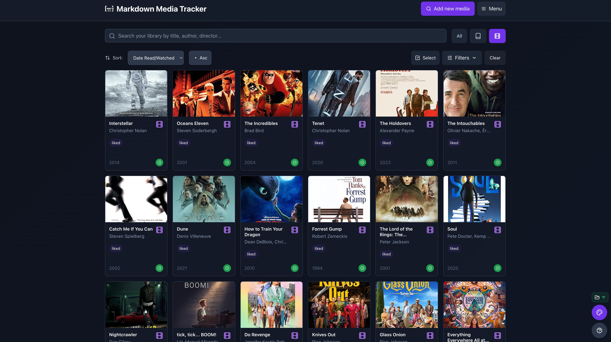
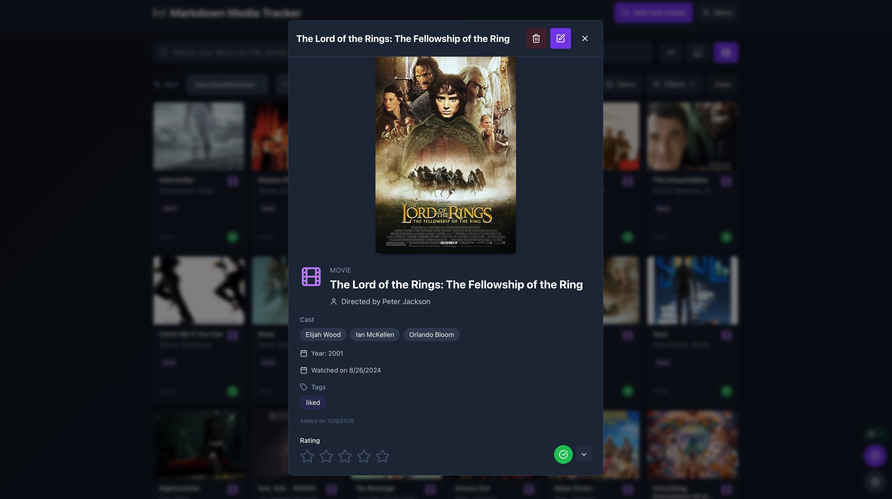

# Markdown Media Tracker

A small, local-first app for tracking books and movies saved as Markdown files with YAML frontmatter. Built with React + Vite and designed to use the browser File System Access API so your library lives in a directory you choose.

## Features

- Store each item (book or movie) as a single `.md` file with YAML frontmatter.
- Browse, search, filter, sort, and batch-edit items.
- Add items manually or search online (Open Library for books, OMDb for movies).
- Customize card size and theme colors.
- Soft-delete to a `.trash` area with an undo stack.

## Requirements

- Node.js (14+ recommended) and npm or yarn
- A Chromium-based desktop browser (Chrome, Edge) that supports the File System Access API. Safari and some browsers do not support this API — see Troubleshooting below.

Example data is included in the `data/` folder so you can browse sample items without selecting a directory.

## Install & run locally

1. Install dependencies

```bash
npm install
# or
# yarn
```

2. Start the dev server (Vite)

```bash
npm run dev
# or
# yarn dev
```

3. Open the URL printed by Vite (usually `http://localhost:5173`) in a supported browser.

When you first open the app you'll be prompted to "Select Directory". Choose or create a directory where the app will save individual `.md` files for each item.

## Configure the OMDb API key

The app uses OMDb (for movie lookups) and Open Library (for books). To configure an OMDb API key, edit the `src/config.js` file and set your key:

```js
// src/config.js
export const config = {
	// Replace the value below with your own OMDb API key
	omdbApiKey: 'YOUR_OMDB_API_KEY_HERE'
};
```

If you don't provide an OMDb API key the movie search functionality will be limited or fail — the app will still work for manual entry and browsing local markdown files.

## How to use (quick tips)

- Select Directory: Click "Select Directory" and pick a folder where you want item `.md` files stored.
- Search Online: Click "Search Online" to look up books (Open Library) or movies (OMDb). Pick a result to import and save.
- Add Manually: Fill in the form to create a new item.
- Filters: Use the Filters panel to narrow results by type (book/movie), rating, recent reads, and tags.
- Selection Mode: Toggle selection to batch-edit or delete multiple items.
- Customize: Click "Customize Style" (bottom-right) to change card size and theme colors.

## Import & Export CSV

- Export CSV: When you've selected a directory, click the "Export CSV" button in the header to download a CSV snapshot of your current library. Fields include title, type, author/director, year, rating, read/watched dates, tags, cover URL, and notes.
- Import CSV: Click "Import CSV" and choose a CSV file exported from this app or a supported service. The app attempts to detect common formats (Goodreads for books, Letterboxd for movies) and will map columns to the internal item fields. Imported items are saved as individual `.md` files in the selected directory.
- Goodreads: Export your "Bookshelf" CSV from Goodreads (My Books → Import/Export). The importer will look for columns like "Title", "Author", "My Rating", "My Review", and "Date Read" and map them to items.
- Letterboxd: Export your CSV from Letterboxd (Settings → Data → Export). The importer will look for columns like "Name", "Year", "Your Rating", and "Date Watched" and map them to movie items.

The importer uses simple heuristics and may not perfectly map every custom CSV. Review imported items and edit any missing details. Basic deduplication is performed by matching Title + Author; duplicates will be skipped. If your browser doesn't support the File System Access API, import will prompt you to select a directory first or use the `data/` folder as a fallback.

## Demo Screenshots

### Select directory screen


### Main grid view



### Item detail modal



### Online search


### Customize appearance


## Troubleshooting

- File System Access API not available: If your browser doesn't support the File System Access API (Safari on macOS and iOS currently lacks full support), the "Select Directory" flow will not work. Options:
	- Use Chrome or Edge on desktop.
	- Run the app inside an Electron wrapper that enables the API.
	- As a temporary fallback you can edit or add markdown files directly in the `data/` folder — the sample files there follow the same structure the app expects.

- OMDb rate limits / API key: If movie searches fail, confirm your OMDb key is set in `src/config.js` and valid. OMDb requires a (free) API key you can get at http://www.omdbapi.com/apikey.aspx.

## Project structure (important files)

- `src/MediaTracker.jsx` — main app UI and logic
- `src/config.js` — place your OMDb API key here
- `data/` — sample markdown items provided for demo/testing
- `public/` — static assets

## Contributing

Contributions are welcome. Open an issue or send a pull request with bug fixes or small improvements. For larger changes, please open an issue first to discuss the design.

## License

This project is licensed under the terms in the repository `LICENSE` file.

---